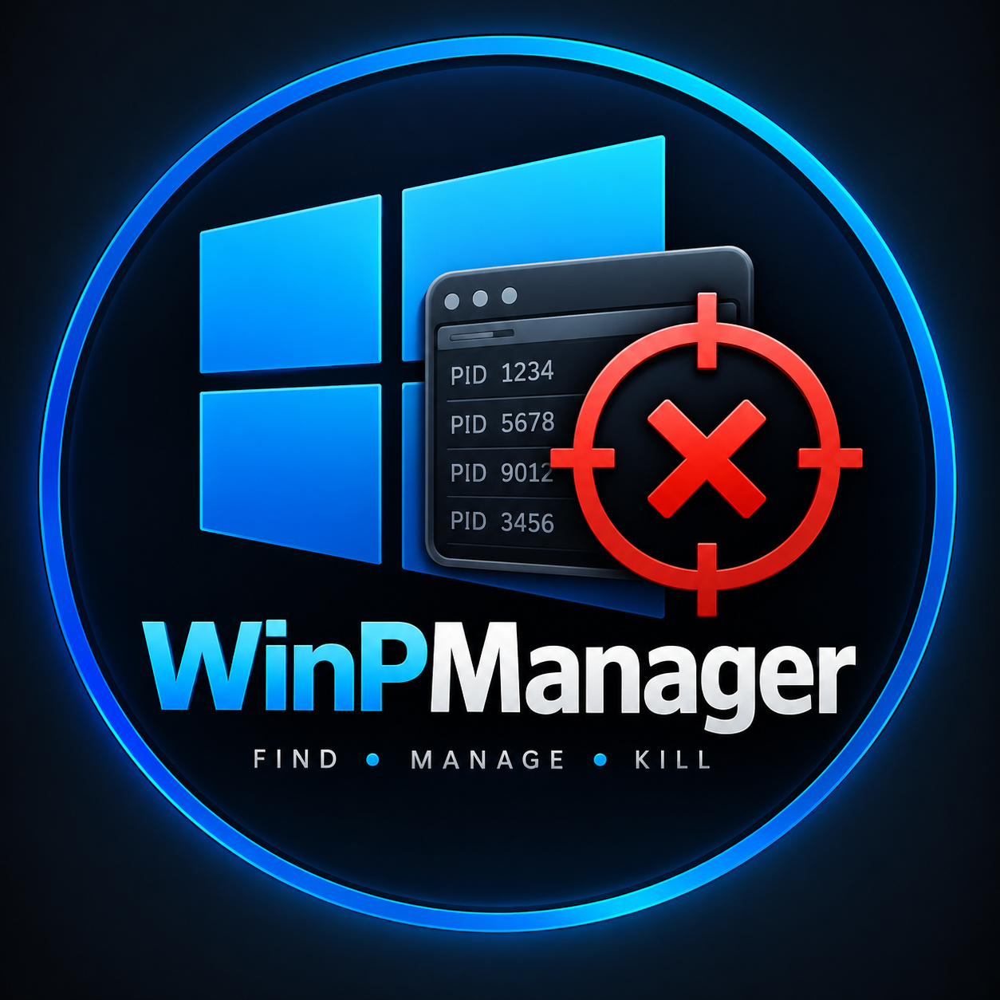

<div align="center">



# WinPManager

**FIND • MANAGE • KILL**

*The high-performance developer port manager and process terminator for Windows.*

Control, inspect, and kill active project ports used by Node.js, Vite, Next.js, TypeScript, Python, Go, Rust, and Docker in **one click**.

[](https://github.com/ProbotisOP/WinPManager)
[](https://github.com/ProbotisOP)
[](https://nodejs.org/)
[](LICENSE)

[Features](#-key-features) • [The Problem It Solves](#-the-problem-it-solves) • [Quick Start](#-quick-start) • [Detection Engine](#-intelligent-heuristics-engine) • [Author](#-author)

</div>

---

## 🛑 The Problem It Solves

Every developer building modern applications hits this roadblock weekly:

```bash
Error: listen EADDRINUSE: address already in use :::3000
```
or:
```bash
Port 5173 is in use, trying another one...
```

### The Old, Frustrating Workflow:
1. You close a terminal window or crash a dev server, but a background `node.exe`, `python.exe`, or `esbuild.exe` child process remains orphaned and locks the port.
2. You open Windows Task Manager, but you cannot search by port number.
3. You open Command Prompt and execute:
   ```cmd
   netstat -ano | findstr :3000
   ```
4. You squint to locate the PID at the end of the line.
5. You run:
   ```cmd
   taskkill /PID 14292 /F
   ```
6. **It still fails** if the process was started via `npm run dev` or `yarn` because the parent wrapper died, leaving orphaned worker subprocesses holding the socket.
7. Traditional port utilities dump 60+ Windows internal system processes (`svchost.exe`, `lsass.exe`, `services.exe`, PID 4) into your view, making it dangerous and cluttered.

---

## ⚡ The Solution: WinPManager

**WinPManager** provides a dedicated, keyboard-friendly Windows desktop application built with a **Linear / Raycast** dark aesthetic. It automatically distinguishes your real development servers from Windows OS services without any hardcoded port lists, giving you immediate control with single-click tree termination.

---

## ✨ Key Features

### 1. 🧠 Intelligent Heuristics Engine (Zero Hardcoded Ports)
- **Dynamic Process Inspection**: Ports are analyzed by examining binary signatures, executable paths, parent process trees, and full command line invocations.
- **Framework Auto-Recognition**:
  - **JavaScript / TypeScript**: Vite, Next.js, React, Nuxt, Astro, SvelteKit, Remix, NestJS, Express, Fastify, Nodemon, `ts-node`, `tsx`.
  - **Runtimes**: Node.js, Bun, Deno.
  - **Python**: FastAPI, Uvicorn, Django, Flask, Streamlit, Gradio.
  - **Systems & Compiled**: Go (`air`, `gin`), Rust (`cargo run`, `actix`, `axum`), `.NET`.
  - **Databases & Containers**: Docker proxies, MySQL, PostgreSQL, Redis, MongoDB.
- **Project Folder Extraction**: Automatically extracts the project directory from execution paths. One click reveals the project folder in Windows File Explorer.

### 2. 🛡️ Dev Shield (Safe Mode)
- **Automatic System Port Isolation**: By default, Windows kernel services (PID 4, `svchost.exe`, `services.exe`, `lsass.exe`, `dwm.exe`, `spoolsv.exe`, etc.) are shielded and hidden from your view.
- **Toggle Scope**: Switch between *Dev Ports* and *Include System* with a single click if you ever need to diagnose OS services. System processes feature protective guards to prevent accidental OS crashes.

### 3. 🌲 Recursive Process Tree Killing (`/F /T`)
- Standard kills leave child workers orphaned. WinPManager executes `taskkill /F /T /PID <pid>` on Windows to recursively eliminate the parent runner, wrapper command, and all spawned subprocesses holding the port.

### 4. ⚡ Quick Port Terminator (Raycast-Style)
- Hit the command bar, type `:3000` or `:5173`, and press `Enter ↵`.
### 5. 🤖 Terminal EADDRINUSE Conflict Sentinel (Lightweight Microservice)
- Whenever a terminal or PowerShell session crashes with `Error: listen EADDRINUSE :::3000` or `address already in use`:
  - The Sentinel microservice immediately displays a sleek native Windows popup dialog showing the blocking process (`node.exe PID 1420`).
  - Hit **[Kill Port 3000]** to instantly terminate the blocker with one click and rerun your command!
  - Start the Sentinel daemon with double-clicking `launch-sentinel.bat` or running `npm run sentinel`.
  - Also comes with a lightning-fast CLI: `winp <port>` (e.g. `winp 3000` to immediately free port 3000 from any terminal).

### 6. 📌 Pinned Ports Status Strip
- Live status indicators for standard developer ports (`:3000`, `:5173`, `:8000`, `:8080`, `:4200`, `:3306`, `:5432`).
- Green status dot when free; amber dot with process name and 1-click termination `✕` button when occupied. Add any custom port to your pinned list.

### 7. 🚀 Terminate All Dev Ports
- Clear every active development server simultaneously with a single button.

### 8. 🔍 Deep Process Inspector
- Inspect full command-line arguments, memory RSS usage, bound network interfaces (`127.0.0.1` vs `0.0.0.0`), uptime, parent PID, and executable path.

---

## 📦 Generating Windows `.exe` & Releases

WinPManager packages into production-grade Windows executables using `electron-builder`:

### 1. Build Portable Executable (.exe)
Generates a standalone single-file `.exe` that runs immediately on any Windows machine with no installation needed:
```bash
npm run dist:portable
```
Output: `release/WinPManager-Portable-1.0.0.exe`

### 2. Build NSIS Windows Setup Installer
Generates a standard Windows installer with Desktop shortcut, Start Menu shortcut, and Uninstaller:
```bash
npm run dist:nsis
```
Output: `release/WinPManager-Setup-1.0.0.exe`

### 3. Automated GitHub Actions CI/CD Releases
A GitHub Actions workflow is pre-configured in `.github/workflows/release.yml`. Whenever you push a git tag (e.g. `v1.0.0`), GitHub Actions will:
1. Automatically build both the Portable `.exe` and NSIS Setup installer.
2. Publish a GitHub Release with download links attached automatically.

```bash
git tag v1.0.0
git push origin v1.0.0
```

---

## 📊 Comparison

| Feature | Windows Task Manager | `netstat` + `taskkill` | WinPManager |
| :--- | :---: | :---: | :---: |
| **Search by Port Number** | ❌ No | ⚠️ Manual grep | ✅ Instant |
| **Filter Out System Processes** | ❌ No | ❌ No | ✅ Yes (Automatic) |
| **Recursive Tree Kill (`/T`)** | ❌ Kills single PID | ⚠️ Manual command | ✅ 1-Click Automatic |
| **Terminal EADDRINUSE Interception** | ❌ No | ❌ No | ✅ Instant Popup |
| **Framework & Project Detection** | ❌ No | ❌ No | ✅ Auto (Vite, Next, etc.) |
| **Open Localhost in Browser** | ❌ No | ❌ No | ✅ 1-Click Button |
| **Reveal Project in Explorer** | ❌ No | ❌ No | ✅ 1-Click Button |
| **Pinned Ports Watchlist** | ❌ No | ❌ No | ✅ Live Ticker |
| **Batch Kill All Dev Ports** | ❌ No | ❌ No | ✅ 1-Click Multi-Kill |

---

## 🚀 Quick Start

### Prerequisites
- Windows 10 or 11 (64-bit)
- [Node.js 18+](https://nodejs.org/) and `npm`

### Installation

1. **Clone the repository**:
   ```bash
   git clone https://github.com/ProbotisOP/WinPManager.git
   cd WinPManager
   ```

2. **Install dependencies**:
   ```bash
   npm install
   ```

3. **Launch the Native Desktop App**:
   Double-click `launch.bat` or run:
   ```bash
   npm start
   ```

4. **Start the Terminal Sentinel Microservice**:
   Double-click `launch-sentinel.bat` or run:
   ```bash
   npm run sentinel
   ```

### Running in Web Mode (Optional)
If you prefer running WinPManager directly in your browser:
```bash
npm run web
```
Then open `http://localhost:5199` in your browser.

---

## 🛠️ Architecture & Tech Stack

```
WinPManager/
├── electron/
│   ├── main.cjs            # Electron main process (frameless window, system tray, IPC)
│   ├── preload.cjs         # Context bridge
│   └── portEngine.cjs      # Intelligent Windows port detection & tree-kill engine
├── src/
│   ├── components/
│   │   ├── TitleBar.tsx    # Windows 11 frameless header with status & controls
│   │   ├── StatsHeader.tsx # Active ports, RSS memory, and Terminate All button
│   │   ├── QuickKillBar.tsx# Instant port strike input (:3000 -> Enter)
│   │   ├── PortWatchlist.tsx # Favorite ports status strip
│   │   ├── FilterBar.tsx   # Scope filters, search, polling interval, and view toggle
│   │   ├── PortTable.tsx   # Pro dense tabular process monitor
│   │   ├── PortCard.tsx    # Technical developer card view
│   │   ├── ProcessModal.tsx# Detailed process inspector (CLI, memory, paths)
│   │   └── Toast.tsx       # Unobtrusive notifications
│   ├── hooks/
│   │   └── usePortManager.ts # Reactive polling & optimistic termination state
│   ├── types/
│   │   └── index.ts        # TypeScript definitions
│   ├── api.ts              # Universal client (Electron IPC + Web REST fallback)
│   ├── App.tsx             # Main dashboard layout
│   └── main.tsx            # React entry
├── server.cjs              # Local REST API fallback
├── launch.bat              # 1-Click Windows desktop launcher
└── launch-web.bat          # 1-Click browser dashboard launcher
```

- **Runtime**: Electron 44 / Node.js
- **UI Framework**: React 19 + TypeScript
- **Styling**: Tailwind CSS v4 + Linear-inspired dark graphite palette
- **Animations**: Framer Motion
- **Icons**: Lucide React
- **Engine**: Native Windows `netstat` + `Win32_Process` CIM queries + `taskkill /F /T`

---

## 🧑‍💻 Author

Developed with precision by **[ProbotisOP](https://github.com/ProbotisOP)**.

- **GitHub Profile**: [@ProbotisOP](https://github.com/ProbotisOP)
- **Project Repository**: [ProbotisOP/WinPManager](https://github.com/ProbotisOP/WinPManager)

Contributions, issues, and feature requests are welcome! Feel free to check the [issues page](https://github.com/ProbotisOP/WinPManager/issues).

---

## 📄 License

This project is licensed under the [MIT License](LICENSE) — feel free to use it across personal and commercial projects.
